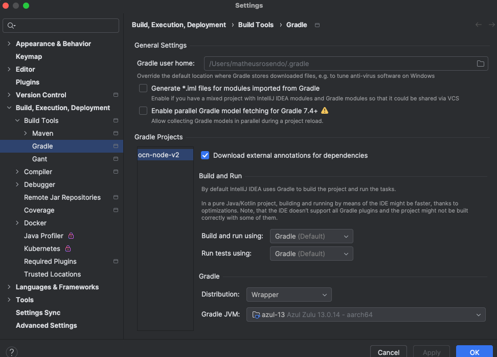
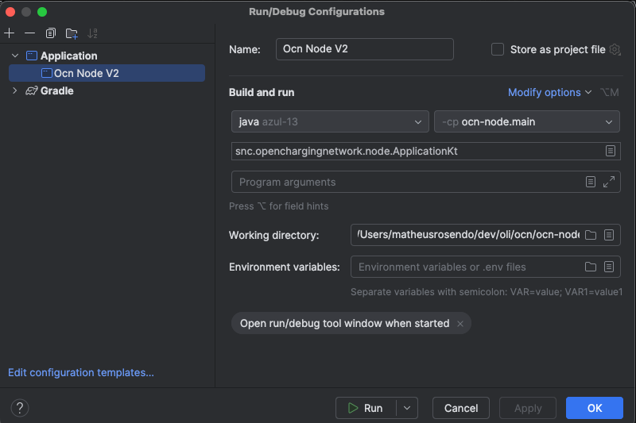

# Open Charging Network Node

The Open Charging Network (OCN) node with Open Charge Point Interface (OCPI) v2.2 API.

This is a community project, aimed at incorporating and building on the open OCPI standard. As with OCPI, contributions 
are welcome in the form of comments, pull requests and raised issues. Visit our 
[issue tracker](https://github.com/energywebfoundation/ocn-node/issues) for an overview of current and past issues. 
Questions may also be asked in the 
[Slack community](https://app.slack.com/client/T0BNK39NX/CRP0VKEMD). 

Before contributing to the source code, please take the time to read over the 
[Developer Certificate of Origin](https://developercertificate.org/). For more information, see our 
[contributing guidelines](https://energy-web-foundation.gitbook.io/energy-web/technology/application-layer/open-charging-network/open-source-development).

## The Open Charging Network

The OCN is a decentralized eRoaming hub. To participate in the OCN, a node must be used to broker OCPI requests
(e.g. start/stop charging requests, POI data retrieval) between parties. A node can be set up and run by anyone, however
to connect to a node, two steps are needed:

1. A registration token (so-called Token A in OCPI terminology) must be generated for the prospective platform by the
node administrator.
2. The platform must register themselves in the [OCN Registry](https://github.com/energywebfoundation/ocn-registry), 
stating that they are using that particular node.

Once a registration token is obtained and the platform is listed in the registry, the OCPI credentials handshake with
the OCN Node can be initiated, providing access to all OCPI modules and interfaces used for peer-to-peer
communication. When a counter-party is found (either offline or via the registry), requests are sent to
them via the sender's OCN Node.

For more information about the OCN, check out the [wiki](https://energy-web-foundation.gitbook.io/energy-web/technology/application-layer/open-charging-network).

## HTTP API Documentation

The [HTTP API Documentation](https://shareandcharge.bitbucket.io) for the OCN Node describes endpoints which can be used
by administrators and users (OCPI parties). Outside of the full OCPI v2.2 API, OCN Nodes provide additional features,
such as the custom OCPI module, _OcnRules_, as well as ways for admins to restrict use and users to query the OCN Registry.

## Dependencies

The OCN Node is built with Kotlin, targeting the JVM. See the sections on running and building a node for
further details.

The choice of operating system is up to the administrator. By and large, the OCN Node has been developed and run on
Unix-like operating systems, particularly Ubuntu and Fedora. There is currently no guarantee that it will work on other
operating systems.


## Tutorial: Running your own Local Open Charging Network

Before running a node and connecting it to a local, test or prod environment, it is recommended to first become
acquainted with how the network operates.
A [tutorial](https://bitbucket.org/shareandcharge/ocn-demo) has been provided to guide administrators and users
of an OCN Node alike through various use case examples.

## Running a Node

First of all, ensure a [Java Runtime Environment](https://openjdk.java.net/install/) (at least version 8) is installed.
For example, via the Ubuntu package manager:
```
sudo apt install openjdk-8-jre
```

Pre-built OCN Node packages can be found on the repository's 
[releases page](https://github.com/energywebfoundation/ocn-node/releases). For the rest of this section
it will be assumed that this was the method chosen by the user. For information about building the node,
see the subsequent section that follows.

Once downloaded, extract the contents of the archive and change directory:
```
tar zxvf ocn-node-1.1.2.tar.gz
cd ocn-node-1.1-2
```

Now we can run our node:
```
java -jar ocn-node-1.1.2.jar
```

### Configuration

By default the OCN Node will use the `dev` profile's runtime properties. These are specified in
`application.dev.properties`. This can be used to get a node up and running and connected to the
OCN public test environment right away.

However, sooner or later it is likely that configuration options must be changed to match the environment.
For example, to configure our local development environment correctly, we might wish to create a new profile
which connects to a blockchain node running locally.

To do so, we can make a copy of the `dev` profile, naming it however we so desire:

```
cp application.dev.properties application.custom-local-env.properties
```

We can then edit our `custom-local-env` properties file to point to the local blockchain node.

If we wish to setup the node for a production environment, an example `prod` profile has been provided too:

```
cp application.prod.properties application.custom-prod-env.properties
```

For details on all available configuration values, please visit our comprehensive
[OCN Node Configuration documentation](./CONFIGURATION.md).


### Listing the Node in the OCN Registry

A Node must be listed in the registry for it to be usable on the network. This can be achieved by installing
the OCN Registry CLI. Either clone the [OCN-Registry](https://github.com/energywebfoundation/ocn-registry) repository
and follow the instructions in the README, or install the NPM package:

```
npm i -g @shareandcharge/ocn-registry
```

Once installed, add your OCN Node url using the private key as set in the node's configuration (note that the wallet
key must be funded and the correct network chosen using the `-n` flag:
```
ocn-registry set-node https://ocn.server.net -n prod -s 0x1c3e5453c0f9aa74a8eb0216310b2b013f017813a648fce364bf41dbc0b37647
```

Alternatively, to register a node on the public test environment, use `-n volta`.

If successful the node is now available for prospective platforms to link themselves to in the OCN Registry.

### Operating the OCN Node

Once the node is running, test that it is working with the following request:

```
curl localhost:8080/health
```

You should see a 200 OK response.

If the node is publicly available (i.e. behind a reverse proxy), also make sure that it is reachable from the outside:

```
curl https://ocn.server.net/health
```

For further usage documentation, consult the [API Documentation](https://shareandcharge.bitbucket.io).


### Putting it all together

By now, we should know how to run an OCN Node, how to configure it, and how to add it to the OCN Registry, which should
allow us to setup a local development environment efficiently.

If running a node on the test or production environment, however, it is necessary to persist the process across
logouts and restarts. The provided `ocn-node.service` file does this for us.

Edit the service file to match your environment, replacing the user and properties file where necessary. For example:
```
[Service]
User=ubuntu
WorkingDirectory=/home/ubuntu/ocn-node-1.1.2
ExecStart=/usr/bin/java -jar -Dspring.config.location=application.custom-prod-env.properties ocn-node-1.1.0.jar
```

Then, copy the service file to the `/etc/systemd/system` directory:
```
sudo cp ocn-node.service /etc/systemd/system
```

Enable and start:
```
sudo systemctl enable ocn-node
sudo systemctl start ocn-node
```

Logs can be displayed using `journalctl`, for example, following and showing last 1000 lines:
```
journalctl -fu ocn-node -n 1000
```


## Development

To be able to build the project, the [Java Development Kit](https://openjdk.java.net/install/) is required.
Make sure at least version 8 is installed and you have the JDK, not only the JRE.

Gradle tasks are configured in `build.gradle.kts` using the Kotlin DSL. The project can be built with:
```
./gradlew build
```

### Run unit tests

```
./gradlew unitTest
```

### Run integration tests

Integration tests depend on `ganache-cli`, a local development blockchain, which is installed using NPM. In one terminal
window, run the following task, which will attempt to install ganache if not already present and then run it:
```
./gradlew ganache
```

Then, run the tests:
```
./gradlew integrationTest
```

### Developing against Ganache

This is helpful for developing without having to worry about funding and managing Ethereum keypairs. With the above
`ganache` task running in the background, the OCN Node can be configured using the following properties:

```
ocn.node.web3.provider = http://localhost:8544
ocn.node.web3.contracts.registry = 0x345ca3e014aaf5dca488057592ee47305d9b3e10
ocn.node.web3.contracts.permissions = 0xf25186B5081Ff5cE73482AD761DB0eB0d25abfBF
```

### Generating new build archives

Make sure the project has been built already, then run:
```
./gradlew archive
```

### Generating new API documentation

Documentation is generated automatically on build. The asciidoc template can be found in
`src/docs/asciidoc/index.adoc` and the output in `build/asciidoc/html5/index.html`.

##  Ocn Node V2
This repo is a fork of the original OCN Node repository at https://github.com/energywebfoundation/ocn-node. The main difference is that this repository is using the OCN Registry 2.0 with different features like the payment system. 
What is still to be done here:
 - update the unit and integration tests;
 - update the overwall libraries including gradle and java;
 - apply and test signatures mode on;

### Local setup for Development using IntelliJ
- Install Java 13
- Setup Gradle Settings

- Create a Run Configuration


